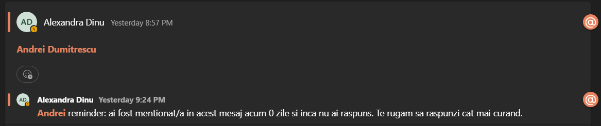
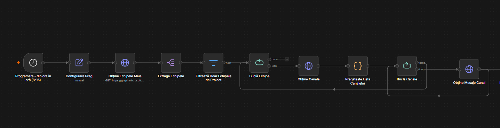
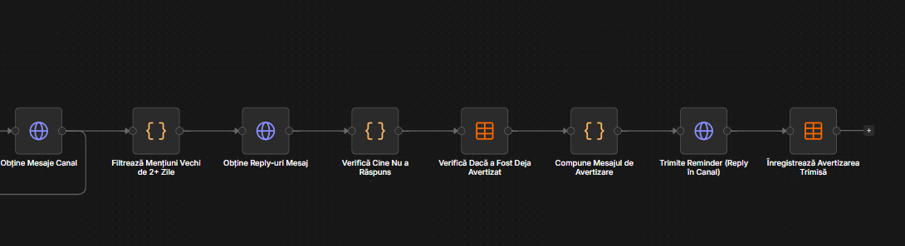

# Avertizare mențiuni Teams fără reply

## Ce face

La fiecare rulare, workflow-ul trece prin toate echipele Teams din care face parte contul conectat, le păstrează doar pe cele „de proiect” (nume care începe cu un cod de 7 cifre, ex. `1234567 - Nume Proiect`), și verifică ultimele mesaje din fiecare canal al acestor echipe. Dacă găsește un mesaj în care cineva a fost menționat (`@Nume`) de cel puțin 2 zile și persoana respectivă nu a scris ea însăși niciun reply în thread, îi trimite un reminder automat ca reply la mesajul original, menționând-o din nou. Fiecare persoană este avertizată o singură dată per mesaj — un jurnal (Data Table) ține evidența avertizărilor deja trimise, ca să nu se repete la fiecare rulare.

## Programare (trigger)

Rulează automat din oră în oră, între orele 8:00 și 16:00, în fiecare zi. În afara acestui interval nu se declanșează.

## Cum funcționează, pe faze

**Faza 1 — Colectare echipe și canale.** Se ia lista echipelor Teams din care face parte contul conectat (`GET /me/joinedTeams`), se filtrează ca să rămână doar echipele de proiect (regex `^\d{7}` pe numele echipei), apoi se iau canalele fiecărei echipe rămase.

**Faza 2 — Detectare mențiuni fără reply.** Pentru fiecare canal se citesc ultimele mesaje (implicit 50, configurabil). Rămân doar mesajele care conțin mențiuni de persoane, sunt mai vechi de 2 zile și nu mai vechi de 14 zile. Pentru fiecare astfel de mesaj se verifică reply-urile din thread: dacă persoana menționată nu a scris ea însăși niciun reply, e considerată „nu a răspuns”.

**Faza 3 — Avertizare + anti-duplicare.** Înainte de a trimite reminderul, se verifică în Data Table `teams_mention_reminders` dacă persoana a mai fost avertizată deja pentru acel mesaj exact. Dacă nu a fost avertizată încă, se trimite un reply în thread-ul original care o menționează, apoi avertizarea se înregistrează în Data Table.

## Parametri configurabili (nodul „Configurare Prag”)

| Parametru | Valoare implicită | Ce controlează |
|---|---|---|
| `mentionDelayDays` | 2 | Câte zile trebuie să treacă de la mențiune înainte ca ea să fie considerată „fără răspuns” și eligibilă pentru reminder. |
| `maxLookbackDays` | 14 | Cât de vechi poate fi cel mult un mesaj ca să mai fie luat în calcul — mențiunile mai vechi de atât sunt ignorate definitiv. |
| `messagesPerChannel` | 50 | Câte mesaje recente se citesc din fiecare canal la fiecare rulare. |

## Cerințe pentru funcționare

Toate apelurile către Microsoft Graph (echipe, canale, mesaje, reply-uri, trimitere reply) folosesc un credențial de tip **Microsoft Teams OAuth2** — trebuie configurat/atașat în n8n pe fiecare nod HTTP Request din workflow, conectat la un cont cu acces la echipele de proiect. Permisiunile Graph necesare includ, cel puțin: citire echipe și canale (`Team.ReadBasic.All`, `Channel.ReadBasic.All`), citire mesaje de canal (`ChannelMessage.Read.All`) și trimitere mesaje de canal (`ChannelMessage.Send`).

De asemenea, este nevoie de un **Data Table** numit `teams_mention_reminders` (ID: `hkcOEOQJKJE6mWBx`), cu coloanele: `notificationKey`, `teamName`, `channelName`, `mentionedUserName`, `messageId`, `notifiedAt`. Acesta funcționează ca jurnal de avertizări trimise, pentru a evita duplicarea reminderelor.

## Formatul mesajului de reminder

Reminderul este postat ca reply în thread-ul original, cu textul (persoana este menționată din nou cu `@`):

> „@Nume reminder: ai fost menționat/ă în acest mesaj acum X zile și încă nu ai răspuns. Te rugăm să răspunzi cât mai curând.”

unde X este numărul de zile scurse de la mesajul original.

## Limitări cunoscute

Se verifică doar ultimele 50 de mesaje per canal (configurabil) — o mențiune aflată mai jos în istoricul canalului nu va fi văzută. Mențiunile mai vechi de 14 zile nu mai declanșează niciodată un reminder, chiar dacă persoana tot nu a răspuns. Apelurile către Microsoft Graph (liste de echipe, canale, mesaje, reply-uri) nu implementează paginare (`@odata.nextLink`) — dacă o echipă are foarte multe canale sau un canal foarte multe mesaje/reply-uri într-o singură pagină de rezultate, unele date ar putea să nu fie citite. Se detectează doar mențiuni de persoane individuale, nu mențiuni de canal sau echipă întreagă.

## Workflow

