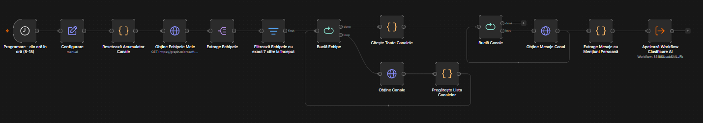
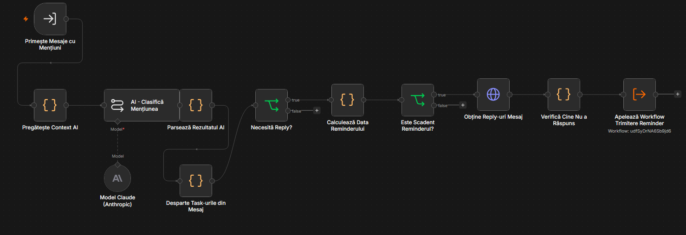
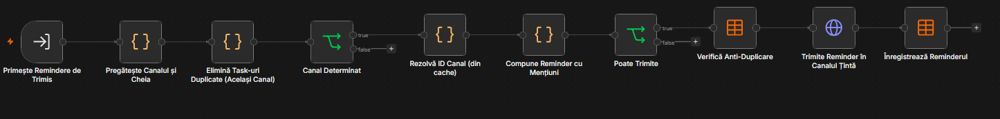
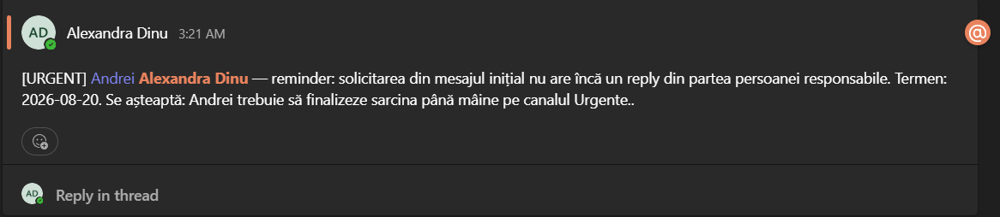
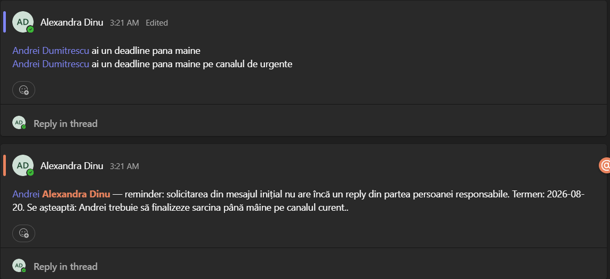

# Avertizare Mențiuni Teams (Complex, cu AI)

Sistem de 3 workflow-uri n8n care scanează automat mesajele din canalele Teams ale echipelor de proiect, folosește un model AI (Claude) ca să înțeleagă fiecare mențiune de persoană — ce se cere, cui, până când și cât de urgent — și trimite remindere doar acolo unde chiar lipsește un răspuns, în canalul potrivit, la momentul potrivit.

Este versiunea „inteligentă" a sistemului de avertizare mențiuni (există și o variantă **Simplă**, în `Avertizare_Mentiuni_Teams_Simplu`, care doar verifică dacă a trecut un număr fix de zile de la mențiune, fără să înțeleagă conținutul mesajului).

## De ce există și ce rezolvă

Într-un proiect cu mai multe specialități și canale, oamenii sunt menționați constant pe Teams — dar nu orice mențiune cere neapărat un răspuns (unele sunt doar informative), nu orice solicitare are aceeași urgență, iar uneori o singură postare conține de fapt mai multe cereri distincte către persoane sau canale diferite. O verificare simplă „a trecut X zile de la mențiune și nu are reply" generează multe remindere inutile (pentru mesaje informative, la care nimeni n-ar trebui să răspundă) și nu ține cont deloc de termene reale sau de urgență.

Acest workflow rezolvă exact asta: citește mesajul, îl trimite unui model AI care îl înțelege în context (proiect, canal, persoane), decide dacă are nevoie de fapt de un răspuns, extrage termenul limită dacă există, stabilește urgența și canalul corect unde ar trebui de fapt discutat subiectul — apoi trimite reminderul doar dacă e cu adevărat cazul.

## Avantaje față de verificarea simplă

Filtrează zgomotul: mesajele informative, de tip feedback sau care nu se încadrează clar nu mai generează remindere — doar cele care chiar așteaptă un răspuns sau o acțiune (întrebare, solicitare, task, confirmare, escaladare, coordonare, reminder al unei cereri mai vechi).

Înțelege termene reale: dacă mesajul conține un termen explicit sau relativ („până mâine", „până vineri"), reminderul e programat cu o zi înainte de acel termen, nu după un număr fix de zile de la mențiune ca în varianta simplă. Dacă însă mesajul nu conține niciun termen detectabil, workflow-ul se comportă exact ca varianta simplă: reminderul devine scadent după 2 zile standard de la mențiune.

Recunoaște urgența: mesajele de tip escaladare sau care reamintesc o cerere mai veche nerezolvată, ori care conțin cuvinte ca „urgent"/„asap"/„azi", primesc un termen de reminder mult mai scurt și un prefix `[URGENT]` vizibil în mesaj.

Desparte cererile multiple dintr-un singur mesaj: dacă o postare conține două solicitări diferite (de exemplu, un task pentru cineva pe canalul curent și altul, distinct, care ține de o altă specialitate), fiecare e tratată separat, cu propriul termen, responsabil și canal.

Rutează reminderul în canalul potrivit: dacă solicitarea ține de fapt de altă specialitate decât canalul unde a fost postată, reminderul e trimis acolo, nu doar înapoi în canalul original.

## Arhitectura: 3 workflow-uri

| # | Workflow | Rol |
|---|---|---|
| 1 | **Principal** | Trigger-ul programat; descoperă echipele de proiect, canalele lor și mesajele cu mențiuni |
| 2 | **Clasificare AI** | Trimite fiecare mesaj către Claude, îl desparte în task-uri, verifică termenul și cine nu a răspuns |
| 3 | **Trimitere Reminder** | Rezolvă canalul țintă, compune mesajul cu mențiuni reale, verifică anti-duplicarea și trimite |

Workflow-ul 1 apelează workflow-ul 2 pentru fiecare canal (fără să aștepte finalizarea, ca să nu încetinească scanarea celorlalte canale); workflow-ul 2 apelează workflow-ul 3 la final, per mesaj eligibil.

## Cum funcționează, pe faze

**Faza 1 — Descoperire echipe și canale** (Workflow Principal). Se ia lista echipelor Teams din care face parte contul conectat, se păstrează doar cele „de proiect" (nume care începe cu 7 cifre), și pentru fiecare se iau toate canalele. Lista completă de canale, per echipă, e reținută pentru a fi folosită mai târziu — atât ca să știe AI-ul ce canale există (pentru rutare), cât și ca să poată rezolva numele unui canal către ID-ul lui real.

**Faza 2 — Extragere mențiuni** (Workflow Principal). Pentru fiecare canal se citesc ultimele mesaje (implicit 50). Rămân doar mesajele care menționează persoane individuale (se ignoră mențiunile de tip @canal/@echipă/@toți) și nu sunt șterse. Pentru fiecare astfel de mesaj, workflow-ul apelează workflow-ul de Clasificare AI.

**Faza 3 — Clasificare AI** (Workflow Clasificare AI). Mesajul, împreună cu contextul lui (echipă, canal, autor, persoane menționate, canalele disponibile ale echipei), e trimis către Claude, care întoarce o listă de task-uri distincte identificate în mesaj — vezi secțiunea dedicată mai jos pentru detalii despre ce anume decide AI-ul pentru fiecare.

**Faza 4 — Verificare termen și reply** (Workflow Clasificare AI). Pentru task-urile care chiar necesită un răspuns, se calculează data la care reminderul devine scadent (cu o zi înainte de termenul detectat, sau după un număr fix de zile dacă nu există termen explicit — mai scurt dacă e urgent). Dacă reminderul e scadent azi, se verifică reply-urile din thread-ul mesajului original; dacă persoana/persoanele responsabile nu au scris ele însele niciun reply, task-ul e trimis mai departe.

**Faza 5 — Rutare și trimitere** (Workflow Trimitere Reminder). Se elimină eventualele task-uri duplicate (același mesaj, canal țintă și persoane), se rezolvă canalul țintă (canalul original sau alt canal, dacă AI-ul a decis așa) către ID-ul lui real, se compune mesajul de reminder cu mențiuni reale către persoanele responsabile, se verifică în Data Table dacă acest exact reminder a mai fost trimis, și dacă nu, se trimite și se înregistrează.

## Clasificarea AI, în detaliu

Pentru fiecare mesaj, AI-ul primește: textul mesajului (curățat de HTML), data postării, echipa, canalul original, autorul, persoanele menționate și lista canalelor disponibile ale echipei — și trebuie să răspundă exclusiv cu un JSON structurat.

**Task-uri multiple.** Dacă mesajul conține mai multe solicitări cu adevărat distincte (subiect, responsabil, termen sau canal țintă diferit), AI-ul le separă în elemente distincte ale array-ului `tasks`, fiecare cu propriile atribute de mai jos. Un mesaj cu un singur subiect (chiar dacă privește mai multe persoane deodată) rămâne un singur task.

**Tipul mesajului (`messageType`)** — fiecare task e încadrat într-una din 10 categorii:

| Categorie | Descriere | Necesită reply? |
|---|---|---|
| INFORMATIV | Anunță ceva, fără să ceară nimic înapoi | Nu |
| INTREBARE | Cere un răspuns concret la o întrebare | Da |
| SOLICITARE_ACTIUNE | Cere o acțiune concretă (trimite fișier, verifică, semnează) | Da |
| TASK | Atribuire clară de sarcină | Da |
| REMINDER_ANTERIOR | Reamintește un task/o cerere mai veche, nerezolvată | Da, urgență ridicată |
| CONFIRMARE | Cere confirmare/aprobare (da/nu) | Da |
| ESCALADARE | Problemă semnalată ca urgentă | Da, urgență ridicată |
| COORDONARE | Propune întâlnire/programare, cere disponibilitate | Da |
| FEEDBACK | Comentariu/observație, fără cerere explicită | Nu |
| ALTA | Nu se încadrează clar | Nu |

**Urgența (`urgency`)** — `URGENT` dacă tipul e ESCALADARE sau REMINDER_ANTERIOR, sau dacă textul conține cuvinte ca „urgent", „asap", „acum", „azi", „imediat"; altfel `NORMAL`. Pentru că fiecare task dintr-un mesaj e evaluat independent de AI, e posibil ca două task-uri provenite din același mesaj (cu același termen) să primească urgențe diferite — de aceea workflow-ul normalizează ulterior: dacă orice task din același mesaj a ieșit URGENT, toate task-urile acelui mesaj devin URGENT.

**Termenul (`deadline`)** — AI-ul detectează un termen explicit sau relativ în text și îl normalizează la o dată exactă (YYYY-MM-DD), separat pentru fiecare task.

**Responsabili și solicitant** — AI-ul stabilește cine e responsabil de task (nu neapărat toate persoanele menționate în mesaj) și cine a solicitat, separat pentru fiecare task.

**Canalul țintă (`targetChannel`)** — dacă task-ul ține clar de tema unui alt canal din echipă (de exemplu „arhitectură" → canalul Birou Arhitectură), AI-ul alege acel canal din lista reală a echipei (nu inventează nume); altfel rămâne canalul original.

## Formatul mesajului de reminder

Reminderul e postat ca mesaj nou în canalul țintă (nu neapărat cel original), cu mențiuni reale către persoana/persoanele responsabile (și către autorul mesajului inițial, dacă nu e deja printre responsabili):

> „[URGENT] @Nume — reminder: solicitarea din mesajul inițial nu are încă un reply din partea persoanei responsabile. Termen: 2026-08-20. Se așteaptă: <acțiunea așteptată, descrisă de AI>."

Prefixul `[URGENT]` apare doar dacă task-ul a fost clasificat ca atare.

## Parametri configurabili (nodul „Configurare")

| Parametru | Valoare implicită | Ce controlează |
|---|---|---|
| `defaultReminderDelayDays` | 2 | Câte zile după mențiune devine scadent reminderul, dacă nu există termen explicit și mesajul nu e urgent |
| `urgentReminderDelayDays` | 0 | Același lucru, dar pentru task-urile urgente (0 = scadent chiar în ziua mențiunii) |
| `maxLookbackDays` | 14 | Cât de vechi poate fi cel mult un mesaj ca să mai fie luat în calcul |
| `messagesPerChannel` | 50 | Câte mesaje recente se citesc din fiecare canal la fiecare rulare |
| `deadlineReminderHour` | 8 | Ora de referință folosită în calculul reminderelor legate de termen |
| `projectTeamNameRegex` | `^\d{7}(?:\D\|$)` | Regexul după care se filtrează echipele „de proiect" |

## Limitări cunoscute

Se citesc doar ultimele 50 de mesaje per canal (configurabil) și cele mai vechi de 14 zile nu mai sunt luate în calcul deloc. Apelurile către Graph nu implementează paginare — canale cu foarte multe mesaje/reply-uri într-o singură pagină pot avea date necitite. Clasificarea AI, deși consistentă la temperatură joasă, rămâne o judecată a modelului, nu o regulă fixă — poate ocazional încadra greșit un mesaj sau varia ușor între task-uri similare (motiv pentru care s-a adăugat normalizarea de urgență descrisă mai sus). Rutarea către alt canal funcționează doar dacă AI-ul recunoaște corect tema task-ului și canalul există în lista reală a echipei.