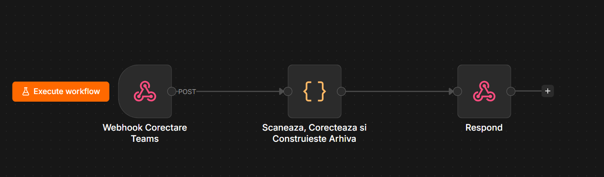
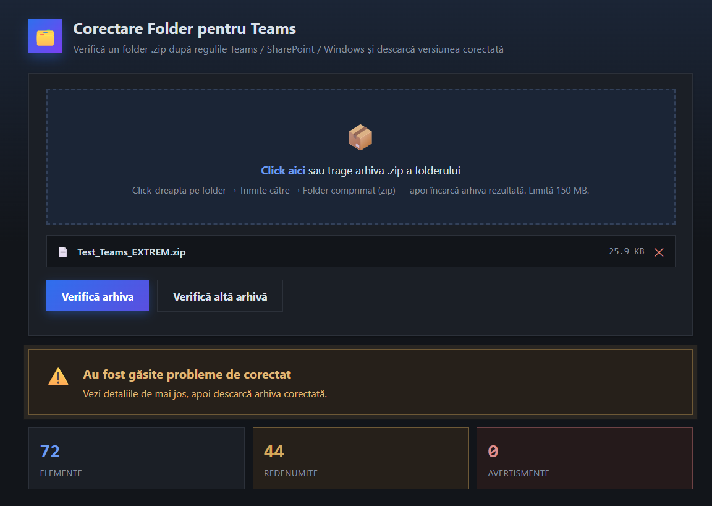
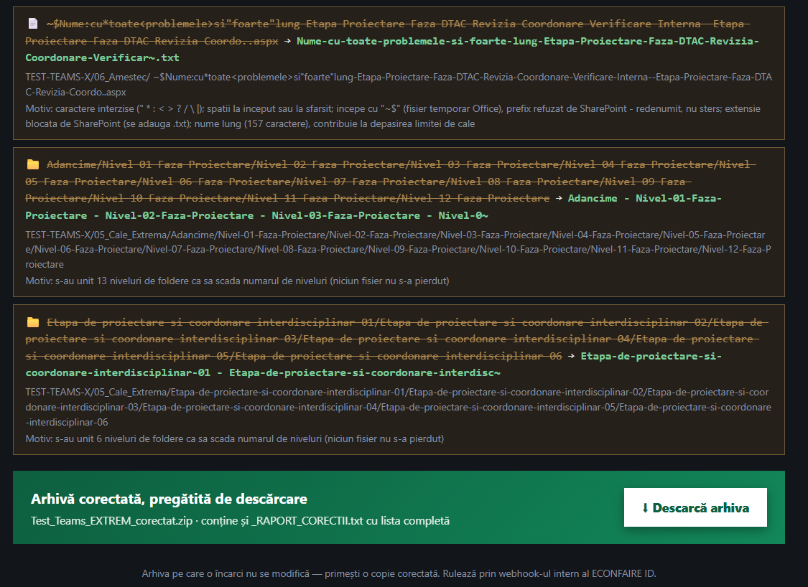

# Corectare Folder pentru Teams

Instrument intern ECONFAIRE ID care verifică o arhivă `.zip` a unui folder și corectează automat problemele de denumire care ar bloca sau ar strica ulterior migrarea / sincronizarea folderului în **Microsoft Teams, SharePoint sau OneDrive** — fără să șteargă niciodată vreun fișier.

Rulează pe **n8n** (workflow + Code node în JavaScript) și are un **client HTML de sine stătător** care poate fi găzduit oriunde (SharePoint, intranet, orice server static) și apelează workflow-ul printr-un webhook.

---

## De ce există

Teams / SharePoint / OneDrive resping sau denaturează silențios fișierele și folderele care:

- conțin caractere interzise (`" * : < > ? / \ |`);
- se termină cu punct sau spațiu;
- folosesc nume rezervate de Windows (`CON`, `NUL`, `COM1`...) sau de SharePoint (`_vti_`, `forms` la rădăcină);
- sunt fișiere temporare/de sistem (`~$temp.xlsx`, `thumbs.db`, `desktop.ini`, `.DS_Store`, fișiere `.~lock.*#` de LibreOffice);
- au o cale prea lungă sau sunt imbricate pe prea multe niveluri.

De obicei, aceste probleme se descoperă abia **după** ce folderul a fost încărcat și migrarea a picat pe jumătate. Acest instrument le găsește și le corectează **înainte**, pe o copie a arhivei, fără să toace originalul.

---

## Workflow

## Ce corectează (regulile aplicate)

Toate corecțiile se aplică **per segment de cale** (fiecare folder și fiecare fișier, în parte):

| Problemă | Corecție |
|---|---|
| Caractere interzise `" * : < > ? / \ |` | Înlocuite cu `-` |
| Caractere de control / invizibile (zero-width, RTL override etc.) | Eliminate |
| Spații (inclusiv spațiu insecabil) la început/sfârșit | Eliminate |
| Termină cu punct | Punctul/punctele finale sunt eliminate |
| Nume rezervat Windows (`CON`, `PRN`, `AUX`, `NUL`, `COM1-9`, `LPT1-9`) | Se adaugă sufix `_folder` / `_fisier` |
| Nume blocat de SharePoint (`thumbs.db`, `desktop.ini`, `.ds_store`, `.dropbox`, `.lock`) | Se adaugă sufix `_folder` / `_fisier` — **fișierul nu se șterge** |
| Prefix `~$` (fișier temporar Office) | Prefixul e eliminat — **fișierul nu se șterge** |
| Fișier de blocare LibreOffice `.~lock.NUME#` | Se scoate învelișul, rămâne `NUME` — **fișierul nu se șterge** |
| Conține `_vti_` (rezervat SharePoint) | Secvența e alterată minimal ca să nu mai declanșeze regula |
| Folder `forms` chiar la rădăcina arhivei | Se adaugă sufix `_folder` |
| Extensie blocată de SharePoint (`.aspx`, `.asmx`, `.ashx`, `.master` etc.) | Se adaugă `.txt` la final |
| Nume peste 255 de caractere | Scurtat, cu extensia păstrată |
| Coliziuni de nume rezultate din corecții | Dezambiguizate automat cu sufix numeric |

### Garanția „zero pierderi de date”

**Niciun fișier nu este exclus din arhiva rezultată.** Tot ce ar fi putut fi „eliminat” într-o versiune anterioară a instrumentului (fișiere de sistem, fișiere temporare, fișiere blocate) este **redenumit**, nu șters. Câmpul `eliminari` din răspuns există doar din motive de compatibilitate cu formatul vechi și va fi mereu gol.

### Reducerea nivelurilor de imbricare

Folderele care au **un singur subfolder și niciun fișier propriu** (lanțuri gen `Proiect/Categorie/Subcategorie/Detaliu/fisier.txt`) sunt unite automat într-un singur nume (`Categorie - Subcategorie - Detaliu`), ca să scadă numărul de niveluri fără să se piardă nicio informație din denumire. Rădăcina arhivei (folderul-proiect) nu este niciodată consumată într-o unire.

### Scurtarea căilor prea lungi

Dacă, după toate corecțiile de mai sus, o cale relativă rămâne prea lungă pentru Windows (peste 180 caractere) sau SharePoint (peste 220 caractere), instrumentul scurtează în mod determinist segmentul cel mai lung din calea respectivă (păstrând extensia fișierului), repetând procesul până când toate căile se încadrează.

---

## Limite

- Dimensiune maximă arhivă: **150 MB** (arhiva e ținută integral în memorie de n8n, plus o copie codificată base64 pentru transportul JSON — de aceea limita e conservatoare).
- Maximum 65.535 de intrări într-o arhivă `.zip` (limita formatului ZIP clasic).

---

## Cum se folosește (utilizator final)

1. Click-dreapta pe folder → *Trimite către* → *Folder comprimat (zip)*.
2. Deschide pagina HTML, trage arhiva `.zip` în zona de upload (sau click pentru a o selecta).
3. Apasă **„Verifică arhiva”**.
4. Verifică raportul: câte elemente au fost redenumite, ce avertismente nu s-au putut corecta automat.
5. Descarcă arhiva corectată
6. Arhiva originală încărcată **nu este niciodată modificată**.

---
