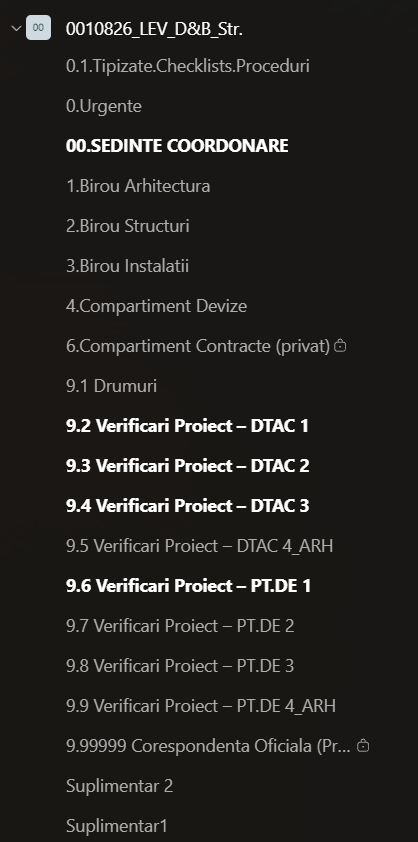

# Inițializare Echipă Proiect (Teams)

Sistem de 3 workflow-uri n8n care creează automat, pornind de la un formular, o echipă completă de proiect pe Microsoft Teams: echipa în sine, toate canalele obligatorii, mesajele inițiale de organizare, membrii din roster-ul standard și tagurile Teams pe funcție.

| # | Workflow | Rol |
|---|---|---|
| 1 | **Inițializare Echipă** | Workflow principal — primește formularul, creează echipa, orchestrează celelalte 2 |
| 2 | **Inițializare Echipă - Canale** | Creează canalele fixe + suplimentare și postează mesajele inițiale |
| 3 | **Inițializare Echipă - Utilizatori** | Adaugă responsabilul ca owner, membrii din roster și tagurile pe funcție |

Cele 3 sunt gândite să ruleze împreună: 2 și 3 nu au trigger propriu (sunt de tip *Execute Workflow Trigger*).

## Workflow 1

Inițializare Echipă. Primește datele din formular (cod proiect, nume proiect, firmă, amplasament, responsabil etc.), creează echipa pe Teams și redenumește canalul General în „00.SEDINTE COORDONARE". Apoi apelează, în paralel, celelalte două workflow-uri și răspunde formularului abia după ce ambele au terminat.

## Workflow 2

Inițializare Echipă - Canale. Creează toate canalele fixe obligatorii ale unui proiect (birourile de specialitate, devize, contracte, drumuri, canalele de verificare DTAC/PT.DE etc.) plus canalele suplimentare cerute în formular. Postează în canalul general mesajele inițiale: bun venit și solicitare de documente către Achiziții/Juridic, regulile de organizare a documentelor pe Teams, și modul de transmitere a temelor între specialități; pe canalele de coordonare postează și un mesaj specific fiecărei faze (DTAC/PT.DE).

## Workflow 3

Inițializare Echipă - Utilizatori. Adaugă responsabilul de proiect ca owner al echipei, apoi citește lista de membri standard dintr-un fișier Excel (Roster_Echipa_Teams.xlsx) și îi adaugă pe toți în echipă, cu rolul de owner sau membru simplu, după cum e completat în Excel. Pentru cei care au o funcție completată în Excel, îi asignează automat la tagul Teams corespunzător (creând tagul dacă nu există deja).

## Structura workflow-urilor (rezumat noduri)

**Workflow 1 — Inițializare Echipă**
Webhook Formular Echipă → Normalizează Payload Webhook → Calculează Nume Echipă & Canale → Creează Echipa Teams → Extrage Team ID → Așteaptă Provisioning → Obține Canalul General → Redenumește Canalul General → Coordonare → (Apeleaza Workflow Utilizatori ‖ Pregateste Date Canale → Apeleaza Workflow Celelalte Canale) → Așteaptă Finalizare → Confirmare Echipă Creată.

**Workflow 2 — Inițializare Echipă - Canale**
Primeste Date din Workflow Echipa → (Canale Fixe Obligatorii (Lista) → Imparte Canale Fixe → Creeaza Canal Fix → [Filtreaza Canale Coordonare → Text Postare Coordonare → Posteaza Mesaj Coordonare]) ‖ (Imparte Canale Suplimentare → Creeaza Canal Suplimentar) ‖ (Posteaza Mesaj Initial → Posteaza Flux Informational → Posteaza Teme) → Asteapta Finalizare Canale → Confirmare Canale Finalizate.

**Workflow 3 — Inițializare Echipă - Utilizatori**
Primeste Date din Workflow Canale → (Adauga Responsabil ca Owner) ‖ (Citeste Roster Fix din Excel → Adauga Membru din Roster la Echipa → Filtreaza Randuri cu Tag → Proceseaza Taguri → [Cauta Tag Existent → Tag Exista? → Adauga la Tag Existent / Creeaza Tag Nou]) → Asteapta Finalizare Utilizatori → Confirmare Utilizatori Adaugati.

