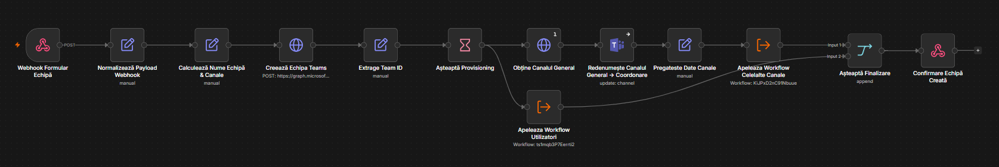
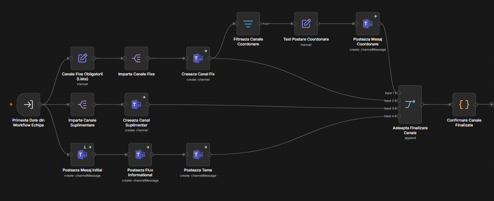
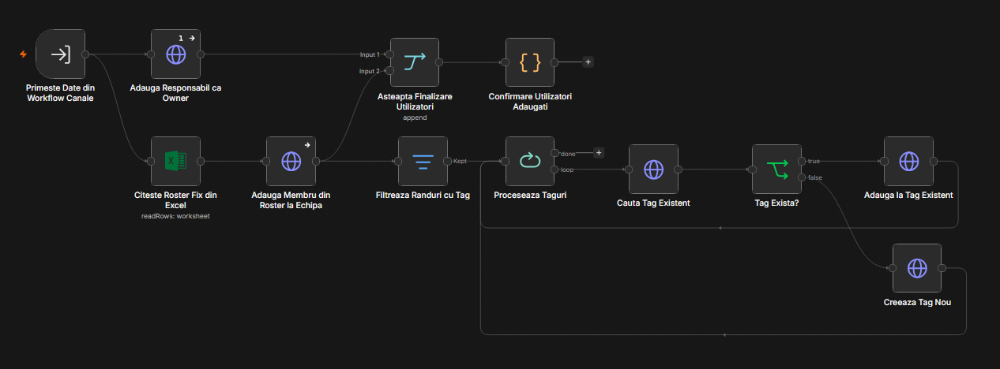
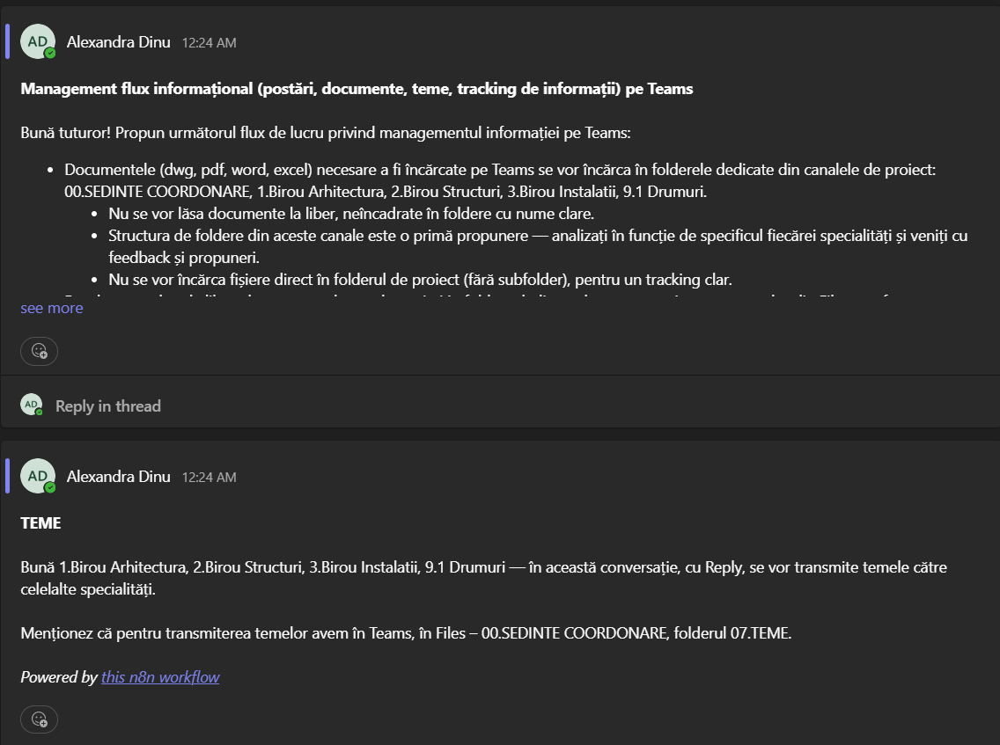

# Inițializare Echipă Proiect (Teams)

Sistem de 3 workflow-uri n8n care creează automat, pornind de la un formular, o echipă completă de proiect pe Microsoft Teams: echipa în sine, toate canalele obligatorii, mesajele inițiale de organizare, membrii din roster-ul standard și tagurile Teams pe funcție.

| # | Workflow | Rol |
|---|---|---|
| 1 | **Inițializare Echipă** | Workflow principal — primește formularul, creează echipa, orchestrează celelalte 2 |
| 2 | **Inițializare Echipă - Canale** | Creează canalele fixe + suplimentare și postează mesajele inițiale |
| 3 | **Inițializare Echipă - Utilizatori** | Adaugă responsabilul ca owner, membrii din roster și tagurile pe funcție |

Cele 3 sunt gândite să ruleze împreună: 2 și 3 nu au trigger propriu (sunt de tip *Execute Workflow Trigger*).

## Workflow 1

Inițializare Echipă. Pornește dintr-un webhook apelat de formularul HTML și primește cod proiect, nume proiect, firmă, amplasament, responsabil de proiect și eventuale canale suplimentare. Calculează numele echipei, creează echipa pe Teams (Graph, template standard) și așteaptă puțin ca Microsoft să termine provisioning-ul înainte de a continua. Redenumește canalul General în „00.SEDINTE COORDONARE", apoi apelează în paralel celelalte două workflow-uri (Canale și Utilizatori) și abia după ce ambele termină răspunde formularului cu mesaj de succes.

## Workflow 2

Inițializare Echipă - Canale. Creează cele 17 canale fixe obligatorii ale unui proiect (birourile de specialitate — Arhitectură, Structuri, Instalații —, Devize, Contracte, Drumuri, canalele de verificare DTAC 1-4 și PT.DE 1-4, Urgențe, Corespondență Oficială privată etc.), plus canalele suplimentare cerute prin formular. În canalul general postează, în ordine, mesajul de bun venit cu solicitare de documente către Achiziții/Juridic, regulile de organizare a fișierelor și discuțiilor pe Teams, și modul de transmitere a temelor între specialități; pe cele 4 canale de coordonare (DTAC 1/2/3, PT.DE 1) postează și câte un mesaj specific fazei respective.

## Workflow 3

Inițializare Echipă - Utilizatori. Adaugă responsabilul de proiect ca owner al echipei, apoi citește lista de membri standard dintr-un fișier Excel (Roster_Echipa_Teams.xlsx, legat de un fișier fix din OneDrive) și îi adaugă pe toți în echipă — owner sau membru simplu, după cum e completat pe coloana „Rol". Pentru fiecare persoană care are completată o funcție pe coloana de taguri, caută dacă există deja un tag Teams cu acel nume; dacă da, o adaugă la tag, dacă nu, creează tagul nou cu persoana ca prim membru.

## Structura workflow-urilor (rezumat noduri)

**Workflow 1 — Inițializare Echipă**
Webhook Formular Echipă → Normalizează Payload Webhook → Calculează Nume Echipă & Canale → Creează Echipa Teams → Extrage Team ID → Așteaptă Provisioning → Obține Canalul General → Redenumește Canalul General → Coordonare → (Apeleaza Workflow Utilizatori ‖ Pregateste Date Canale → Apeleaza Workflow Celelalte Canale) → Așteaptă Finalizare → Confirmare Echipă Creată.

**Workflow 2 — Inițializare Echipă - Canale**
Primeste Date din Workflow Echipa → (Canale Fixe Obligatorii (Lista) → Imparte Canale Fixe → Creeaza Canal Fix → [Filtreaza Canale Coordonare → Text Postare Coordonare → Posteaza Mesaj Coordonare]) ‖ (Imparte Canale Suplimentare → Creeaza Canal Suplimentar) ‖ (Posteaza Mesaj Initial → Posteaza Flux Informational → Posteaza Teme) → Asteapta Finalizare Canale → Confirmare Canale Finalizate.

**Workflow 3 — Inițializare Echipă - Utilizatori**
Primeste Date din Workflow Canale → (Adauga Responsabil ca Owner) ‖ (Citeste Roster Fix din Excel → Adauga Membru din Roster la Echipa → Filtreaza Randuri cu Tag → Proceseaza Taguri → [Cauta Tag Existent → Tag Exista? → Adauga la Tag Existent / Creeaza Tag Nou]) → Asteapta Finalizare Utilizatori → Confirmare Utilizatori Adaugati.

