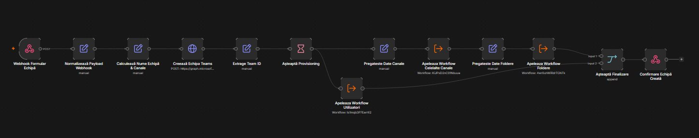
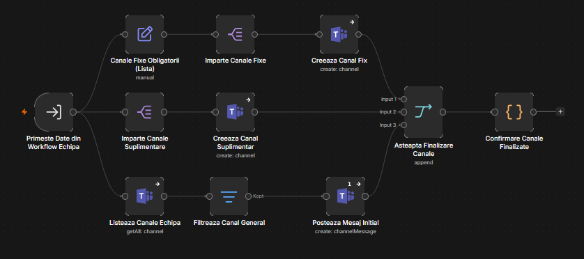
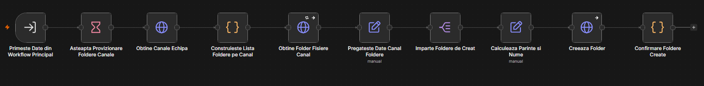
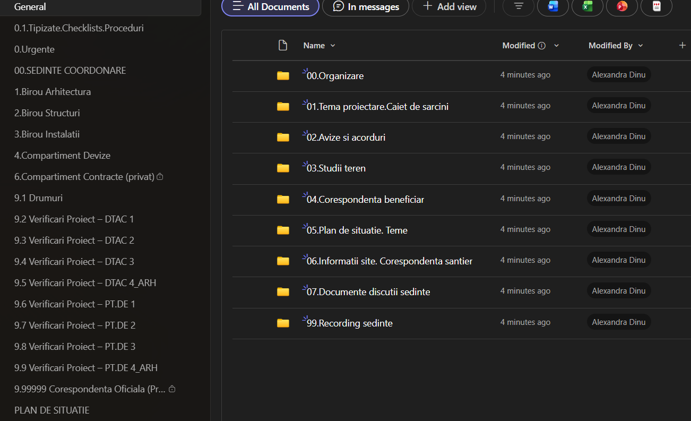
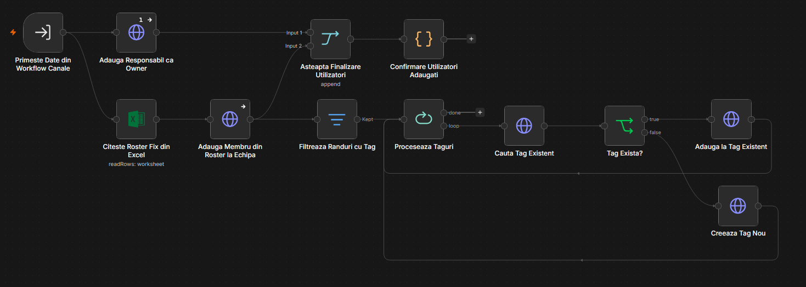

# Inițializare Echipă Proiect (Teams)

Sistem de 4 workflow-uri n8n care creează automat, pornind de la un formular, o echipă completă de proiect pe Microsoft Teams: echipa în sine, toate canalele obligatorii, structura de foldere din fiecare canal, mesajul inițial de organizare, membrii din roster-ul standard și tagurile Teams pe funcție.

| # | Workflow | Rol |
|---|---|---|
| 1 | **Inițializare Echipă** | Workflow principal — primește formularul, creează echipa, apelează celelalte 3 |
| 2 | **Inițializare Echipă - Canale** | Creează canalele fixe + suplimentare și postează mesajul inițial |
| 3 | **Inițializare Echipă - Foldere** | Creează structura de foldere standard în Files, pe fiecare canal relevant |
| 4 | **Inițializare Echipă - Utilizatori** | Adaugă responsabilul ca owner, membrii din roster și tagurile pe funcție |

Cele 4 sunt gândite să ruleze împreună: 2, 3 și 4 nu au trigger propriu (sunt de tip *Execute Workflow Trigger*). Utilizatori rulează în paralel cu perechea Canale → Foldere (foldere se creează abia după ce canalele există), iar formularul primește răspuns doar după ce ambele ramuri s-au terminat.

## Workflow 1

Inițializare Echipă. Pornește dintr-un webhook apelat de formularul HTML și primește cod proiect, nume proiect, firmă, amplasament, design and build (Da/Nu), responsabil de proiect și eventuale canale suplimentare. Calculează numele echipei, creează echipa pe Teams (Graph, template standard) și așteaptă puțin ca Microsoft să termine provisioning-ul înainte de a continua. Apelează în paralel workflow-ul de Utilizatori și lanțul Canale → Foldere, apoi abia după ce ambele ramuri termină răspunde formularului cu mesaj de succes.

## Workflow 2

Inițializare Echipă - Canale. Creează cele 18 canale fixe obligatorii ale unui proiect (00.SEDINTE COORDONARE, Urgențe, Tipizate.Checklists.Proceduri, birourile de specialitate — Arhitectură, Structuri, Instalații —, Devize, Contracte (privat), Drumuri, canalele de verificare DTAC 1-4 și PT.DE 1-4, Corespondență Oficială privată, Plan de Situație), plus canalele suplimentare cerute prin formular. Identifică apoi canalul General al echipei și postează în el mesajul de bun venit cu solicitarea de documente către Achiziții/Juridic (tema de proiectare, cantități și ofertă de la licitație, personal cheie, clarificări, contract).

## Workflow 3

Inițializare Echipă - Foldere. Așteaptă provizionarea canalelor, apoi ia lista completă de canale ale echipei și, pentru cele relevante (General, 1.Birou Arhitectura, 2.Birou Structuri, 3.Birou Instalatii, 4.Compartiment Devize, 9.1 Drumuri), citește folderul de fișiere asociat fiecărui canal și creează acolo structura standard de subfoldere (organizare, piese scrise, colaborare subcontractanți, teme, avize, studii de teren etc.), respectând ierarhia părinte/copil dintre foldere.

### Imagine cu folderele create in canalul general (fiecare cu subfoldere proprii):

## Workflow 4

Inițializare Echipă - Utilizatori. Adaugă responsabilul de proiect ca owner al echipei, apoi citește lista de membri standard dintr-un fișier Excel (Roster_Echipa_Teams.xlsx, legat de un fișier fix din OneDrive) și îi adaugă pe toți în echipă — owner sau membru simplu, după cum e completat pe coloana „Rol". Pentru fiecare persoană care are completată o funcție pe coloana de taguri, caută dacă există deja un tag Teams cu acel nume; dacă da, o adaugă la tag, dacă nu, creează tagul nou cu persoana ca prim membru.

## Funcționalitate workflow

La fiecare proiect nou câștigat, înființarea echipei pe Teams înseamnă, în mod normal, o serie întreagă de pași manuali, repetitivi și ușor de amânat sau uitat: crearea echipei, adăugarea pe rând a celor 18 canale obligatorii (plus eventuale canale suplimentare specifice proiectului), construirea structurii de foldere din Files pe fiecare canal relevant, redactarea și postarea mesajului inițial de organizare, adăugarea fiecărui membru din roster-ul standard cu rolul corect, și crearea sau completarea tagurilor Teams pe funcție pentru fiecare persoană. Făcut manual, acest proces poate dura ore întregi, depinde de disponibilitatea și atenția unei singure persoane, și e predispus la inconsecvențe — un canal uitat, un folder lipsă, un membru neadăugat la tagul lui de funcție, o denumire ușor diferită față de proiectul anterior.

Cu acest sistem, tot procesul se reduce la completarea unui formular cu datele de bază ale proiectului (cod, nume, firmă, amplasament, responsabil) și un singur click. În câteva minute, fără nicio intervenție ulterioară, echipa există complet și identic structurată ca toate celelalte proiecte ale companiei: aceleași canale, aceeași organizare de foldere, același mesaj de bun venit, aceiași membri standard adăugați cu rolul corect și cu tag pe funcție. Standardizarea asta contează dublu — pe de o parte, orice persoană nouă care intră pe un proiect găsește aceeași structură familiară, indiferent cine a inițializat echipa; pe de altă parte, timpul unei persoane responsabile de proiecte (de multe ori un manager sau un coordonator, a cărui oră costă mult mai mult decât durata unei sarcini administrative) nu se mai duce pe muncă repetitivă, ci rămâne disponibil pentru lucruri care chiar au nevoie de judecată și experiență.