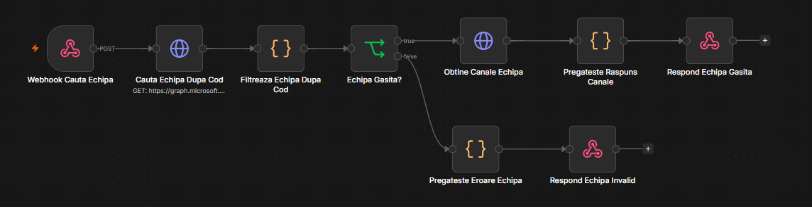
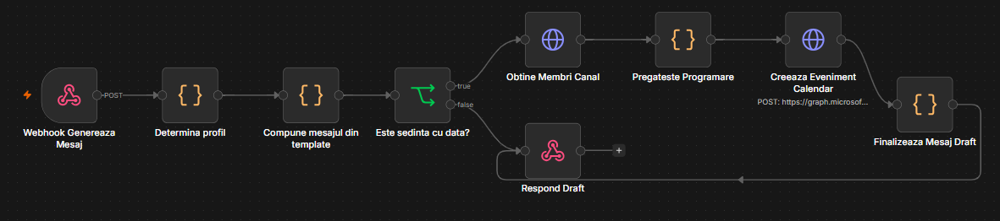
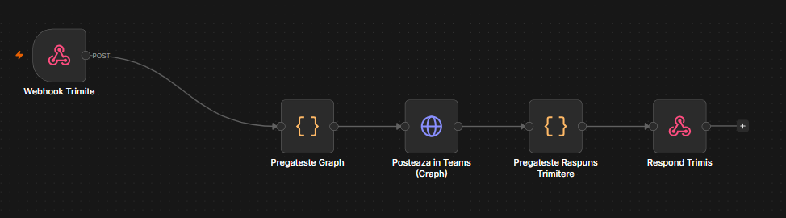

# Postare Teams din template — README

Formularul din pagina HTML are 3 pași, fiecare corespunzând unui webhook din workflow:

1. **Cod echipă** — utilizatorul introduce codul de proiect (7 cifre). Workflow-ul caută echipa Teams al cărei nume începe cu acel cod și returnează lista canalelor ei.
2. **Tip postare + canal + câmpuri** — utilizatorul alege tipul de postare, canalul țintă și completează câmpurile specifice (dată, oră, sală, obiecte, link, detalii). Workflow-ul compune textul din template și îl întoarce ca **draft editabil**; dacă e o ședință cu dată fixă, creează în paralel evenimentul de calendar pentru membrii canalului.
3. **Revizuire + trimitere** — utilizatorul poate edita manual textul, apoi îl trimite; workflow-ul postează mesajul efectiv în canalul ales.

## Cele 3 webhook-uri

| Endpoint | Rol |
|---|---|
| `POST /postare-teams/cauta-echipa` | Caută echipa după cod și returnează canalele |
| `POST /postare-teams/genereaza-mesaj` | Determină tipul de postare, compune textul din template, creează evenimentul de calendar (dacă e cazul) |
| `POST /postare-teams/trimite` | Postează mesajul final în canal |

## Faza 1

## Faza 2

## Faza 3

## Detalii pe fază

**Căutare echipă** — echipele sunt listate prin `GET /me/joinedTeams` și filtrate după primele 7 caractere din nume; dacă nu găsește exact o potrivire, întoarce eroare. Pentru echipa găsită, ia toate canalele ei (`GET /teams/{id}/channels`).

**Generare mesaj** — pe baza tipului de postare ales, textul e compus dintr-un catalog hardcodat de 29 de template-uri (vezi tabelul de mai jos), cu substituții simple (proiect, dată, oră, sală, obiecte, link, detalii). Dacă tipul e o ședință cu dată fixă (stabilire dată, extinsă, discuții execuție, CTS beneficiar, coordonare, coordonare cantități), workflow-ul ia și membrii canalului țintă și creează un eveniment `POST /me/events` (ședință online Teams, cu toți membrii canalului ca participanți) — invitația de calendar ajunge pe email, cu buton de Join generat automat de Outlook.

**Trimitere** — textul (eventual editat) e postat ca mesaj nou în canal.

## Catalogul de tipuri de postare (29)

| Tip postare | Ce anunță |
|---|---|
| A. Documentatie proiect pe Teams | Documentația de proiect a fost încărcată; cere lista persoanelor de adăugat |
| A. Lansare de proiect | Propune data ședinței de lansare și activitățile de pregătire |
| A. Management flux informational | Regulile de organizare a documentelor/discuțiilor pe canale |
| A. Date generale, antet, cartus, reguli | Date generale de proiect, antet, cartuș, reguli de proiectare |
| B. Studii teren (Topo/Geo) | Studiul topografic și geotehnic, cu temele atașate |
| B. Certificat de urbanism / Avize | CU și avizele obținute |
| B. Vizita amplasament | Data/ora vizitei, lista participanților, checklist |
| C. Realizare proiect in ACC | Crearea proiectului în ACC, structura de foldere, versiunea Revit |
| C. Proiectant extern | Colaborare cu proiectant extern, folosirea tag-ului Teams |
| C. Workflow verificari | Completarea responsabililor de verificare |
| D. Sedinta - propunere data (poll disponibilitate) | Cere propuneri de dată/interval prin Reply |
| D. Sedinta - stabilire data | Confirmă data/ora stabilită |
| D. Sedinta extinsa | Ședința extinsă și activitățile de pregătire |
| D. Discutii cu executia (solutii tehnice) | Ședință cu execuția, subiecte de discutat |
| D. Sedinta CTS beneficiar | Ședința CTS cu beneficiarul |
| D. Sedinta de coordonare | Ședința de coordonare pe obiect |
| D. Sedinta coordonare cantitati | Ședința de coordonare a cantităților |
| E. Flux de lucru / verificari / reguli | Regulile de flux de lucru și verificări |
| E. Actualizare documentatie in ACC | Actualizarea periodică a documentației în ACC |
| E. Postare coordonare per obiect (DTAC/PTDE) | Fir dedicat de coordonare pe obiect/fază |
| F. Predare DTAC/PSI/DTAD | Termenul de predare DTAC/PSI/DTAD |
| F. Detach faza intermediara DTAC | Detach-uri în ACC pentru faza intermediară |
| F. Predare documentatie PTDE | Termenul de predare fizică PTDE |
| F. Detach PT predat | Detach-uri pentru PT-ul predat |
| F. Mesaj dupa predarea PTDE | Mesaj liber, post-predare PTDE |
| F. Finalizare cantitati | Mesaj liber, finalizare cantități |
| F. Realizare nota justificativa | Mesaj liber, realizare notă justificativă |
| F. Predare DALI (1 exemplar) | Termenul de predare DALI |
| F. Lectii invatate | Completarea formularului de Lecții Învățate |

## Funcționalitate generală

Aplicația simplifică procesul de creare și publicare a comunicărilor de proiect în Microsoft Teams, pornind de la un formular unic și folosind template-uri predefinite pentru fiecare tip de postare.

Utilizatorul nu trebuie să caute manual echipa sau canalul și nici să redacteze de la zero mesajele repetitive. Pe baza codului de proiect, aplicația identifică automat echipa și pune la dispoziție canalele disponibile, după care generează un draft adaptat tipului de comunicare și informațiilor introduse. 

Draftul poate fi verificat și modificat înainte de publicare. La trimitere, mesajul este transmis direct în canalul Teams selectat prin Microsoft Graph API. 

Pentru tipurile de postări asociate unor ședințe cu dată și oră stabilite, aplicația automatizează și partea de calendar: identifică membrii canalului și creează un eveniment Teams/Outlook cu participanții și agenda corespunzătoare.

În acest mod, fluxul de lucru este redus la trei acțiuni principale: alegerea proiectului și a canalului → completarea informațiilor și revizuirea draftului → publicarea mesajului, cu automatizarea suplimentară a programării ședințelor acolo unde este necesar.
