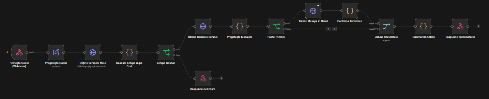

# Postare Mesaje Coordonare / Teme

Workflow n8n cu un singur pas: pornind de la codul echipei (proiectului), caută echipa Teams corespunzătoare și postează dintr-o singură acțiune 10 mesaje predefinite de coordonare și transmitere de teme, fiecare în canalul lui, menționând la fiecare postare cele 4 canale de specialitate (Arhitectură, Structuri, Instalații, Drumuri).

Formularul HTML cere doar codul echipei (7 cifre) — nu există pași sau alegeri suplimentare; la trimitere, toate cele 10 mesaje sunt postate automat, iar pagina arată un spinner cât timp rulează workflow-ul și apoi confirmarea de succes.

## Cum funcționează

Codul echipei e trimis către webhook, care caută în echipele Teams din care face parte contul conectat al cărei nume începe cu acel cod. Dacă nu găsește exact o echipă, răspunde cu eroare și formularul o afișează (fără să posteze nimic).

Dacă echipa e găsită, se iau toate canalele ei (Graph) și se pregătesc cele 10 mesaje: pentru fiecare, se caută canalul țintă după nume; dacă un canal (fie cel țintă, fie unul dintre cele 4 de specialitate folosite la mențiuni) lipsește, mesajul respectiv nu se trimite, iar lipsa e notată separat ca observație în rezumatul final — restul mesajelor pentru care canalele există se trimit normal.

Fiecare mesaj postat conține, la început, mențiunile reale (`@`) către canalele Arhitectură, Structuri, Instalații și Drumuri, urmate de titlul specific și o linie de închidere care indică, prin Reply, ce trebuie discutat sau transmis în acel canal.

Dacă toate cele 10 mesaje au fost postate cu succes, pagina afișează doar confirmarea generică „Finalizat cu succes!", fără niciun alt mesaj sau detaliu suplimentar. Dacă însă a apărut o problemă (unul sau mai multe canale nu au fost găsite), sub confirmarea de succes apare structurat, ca listă, un bloc „Observații" cu câte o linie pentru fiecare canal lipsă și mesajul care nu a putut fi trimis din cauza asta — blocul acesta nu apare deloc atunci când nu există nicio problemă.

## Cele 10 mesaje postate

| Canal țintă | Titlul mesajului |
|---|---|
| 9.2 Verificari Proiect – DTAC 1 | Coordonare Arhitectura- Rezistenta-Instalatii-Drumuri faza DTAC 1 |
| 9.3 Verificari Proiect – DTAC 2 | Coordonare Arhitectura-Rezistenta-Instalatii-Drumuri faza DTAC 2 |
| 9.4 Verificari Proiect – DTAC 3 | Coordonare Arhitectura-Rezistenta-Instalatii-Drumuri faza DTAC 3 |
| 2.Birou Structuri | Teme catre Structuri |
| 1.Birou Arhitectura | Teme catre Arhitectura |
| 3.Birou Instalatii | Teme catre Instalatii |
| 9.1 Drumuri | Teme catre Drumuri |
| 9.6 Verificari Proiect – PT.DE 1 | Coordonare Arhitectura- Rezistenta-Instalatii-Drumuri faza PT.DE 1 |
| 9.7 Verificari Proiect – PT.DE 2 | Coordonare Arhitectura-Rezistenta-Instalatii-Drumuri faza PT.DE 2 |
| 9.8 Verificari Proiect – PT.DE 3 | Coordonare Arhitectura-Rezistenta-Instalatii-Drumuri faza PT.DE 3 |

## Funcționalitate workflow

La fiecare proiect nou, aceleași 10 mesaje de coordonare și transmitere de teme trebuie postate, identic ca text și structură, doar în canalele echipei respective — practic un mesaj standard repetat pe mai multe proiecte. Făcut manual, asta înseamnă pentru fiecare echipă: deschiderea pe rând a 10 canale, scrierea sau copierea textului potrivit în fiecare, și adăugarea manuală a mențiunilor către cele 4 canale de specialitate în fiecare postare — o operațiune repetitivă, care ia timp și unde e ușor să sari un canal, să greșești o mențiune sau să postezi textul greșit la canalul greșit.

Cu acest workflow, tot acest proces se reduce la introducerea codului echipei și un singur click. Textul standard, canalele țintă și mențiunile sunt fixate o singură dată în workflow, nu se mai retastează la fiecare proiect; utilizatorul nu mai trebuie să știe pe de rost care mesaj merge în care canal sau ce trebuie menționat de fiecare dată. Dacă un canal lipsește (de exemplu echipa nu are încă toate canalele create), workflow-ul nu se oprește — trimite ce poate, iar erorile pentru ce nu a putut fi postat apar structurat, ca listă, sub confirmarea de succes, astfel încât să poată fi corectate punctual, fără să se reia tot procesul de la zero.
