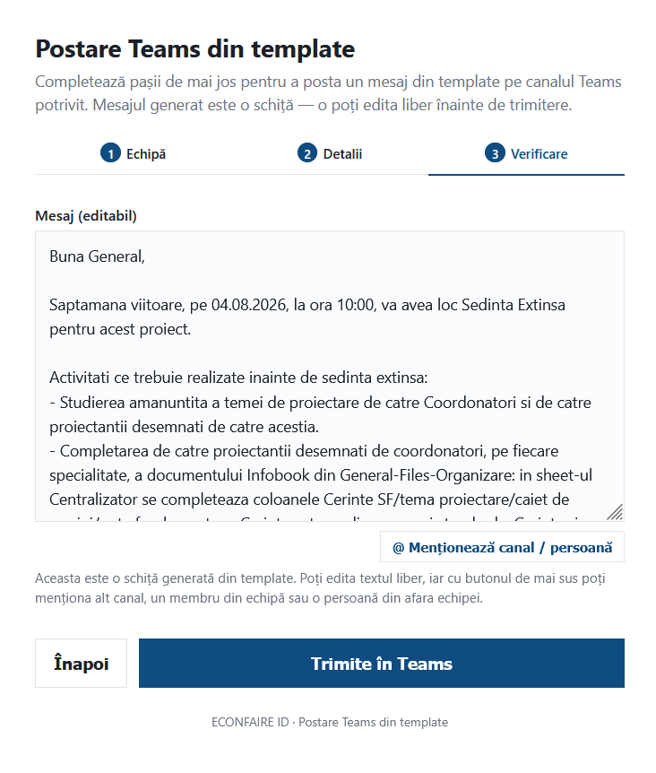

# Postare Teams din template

Workflow n8n (3 webhook-uri, expuse printr-o singură pagină HTML în 3 pași) care generează și postează pe Teams mesaje standardizate de organizare a proiectului — 25 de tipuri de postare, grupate pe categorii A-F (documentație/lansare, studii teren/vizită, ACC/proiectant extern/verificări, ședințe, flux de lucru/coordonare, predare fază). Utilizatorul introduce codul echipei, alege tipul de postare și canalul, primește o schiță generată automat din template, o poate edita liber și adăuga mențiuni (alt canal, un membru din echipă sau o persoană din afara echipei), apoi o trimite pe Teams. Pentru tipurile de postare care sunt ședințe cu dată stabilită, workflow-ul creează în paralel și evenimentul de calendar, cu toți membrii canalului ca participanți.

| # | Pas (webhook) | Rol |
|---|---|---|
| 1 | **cauta-echipa** | Găsește echipa Teams după codul de proiect (7 cifre) și întoarce canalele și membrii ei |
| 2 | **genereaza-mesaj** | Determină profilul postării (info / ședință / vizită / predare) și compune schița de mesaj din template |
| 3 | **trimite** | Postează mesajul final (editat de utilizator) pe canalul ales, cu mențiunile adăugate; dacă e ședință cu dată, creează și evenimentul de calendar |

## Faza 1 — Căutare echipă

Formularul cere codul echipei (7 cifre). Workflow-ul caută în echipele Teams din care face parte contul conectat (`GET /me/joinedTeams`), păstrează echipa al cărei nume începe cu acel cod, apoi îi ia canalele și membrii (Graph). Acestea sunt întoarse către formular și rămân disponibile pentru pașii următori — inclusiv pentru panoul de mențiuni din pasul 3, fără alt apel.

## Faza 2 — Tip postare, canal și detalii

Utilizatorul alege tipul de postare dintr-o listă de 25 de șabloane și canalul Teams destinație, apoi completează câmpurile dinamice specifice tipului ales (dată, oră, sală, obiecte, link-uri, detalii — câmpurile diferă după profilul postării: informare, ședință, vizită amplasament sau predare fază). Workflow-ul determină profilul și compune schița de mesaj din template, completând datele introduse.

| Categorie | Tip postare | Cand se foloseste |
|---|---|---|
| A | Documentatie proiect pe Teams | Anunta ca s-a incarcat documentatia de proiect (SF, caiet de sarcini, documentatie licitatie) si cere lista persoanelor de adaugat in Teams |
| A | Lansare de proiect | Propune data si ora sedintei de lansare a proiectului |
| A | Management flux informational | Stabileste regulile de organizare a fisierelor si discutiilor pe Teams |
| A | Date generale, antet, cartus, reguli | Centralizeaza datele generale de proiect, antetul pieselor scrise, familia de cartus si regulile de proiectare |
| B | Studii teren (Topo/Geo) | Transmite temele pentru studiul topografic si studiul geotehnic |
| B | Certificat de urbanism / Avize | Anunta ca certificatul de urbanism si avizele obtinute sunt disponibile |
| B | Vizita amplasament | Anunta data si ora vizitei in amplasament si cere lista participantilor |
| C | Realizare proiect in ACC | Anunta crearea proiectului in ACC, cu structura de foldere pe specialitati/obiecte |
| C | Proiectant extern | Anunta colaborarea cu un proiectant extern si eticheta Teams asociata |
| C | Workflow verificari | Cere completarea responsabililor de verificare, pentru crearea workflow-urilor de verificare in ACC |
| D | Sedinta - propunere data (poll disponibilitate) | Cere propuneri de zi si interval orar pentru o sedinta ce urmeaza a fi stabilita |
| D | Sedinta - stabilire data | Confirma data si ora sedintei, in urma disponibilitatilor primite |
| D | Sedinta extinsa | Anunta sedinta extinsa si activitatile de pregatit inainte de aceasta |
| D | Discutii cu executia (solutii tehnice) | Centralizeaza subiectele de discutat cu executia pentru solutii tehnice |
| D | Sedinta CTS beneficiar | Anunta sedinta CTS cu beneficiarul si activitatile de pregatit |
| D | Sedinta de coordonare | Anunta sedinta de coordonare pe un obiect anume |
| D | Sedinta coordonare cantitati | Anunta sedinta de coordonare cantitati pe un obiect anume |
| E | Flux de lucru / verificari / reguli | Transmite pasii de urmat in procesul de proiectare si verificare |
| E | Actualizare documentatie in ACC | Cere incarcarea actualizata a documentatiei in ACC, la stadiul curent |
| E | Postare coordonare per obiect (DTAC/PTDE) | Deschide o postare de coordonare intre specialitati, pentru un obiect si o faza (DTAC/PTDE) |
| F | Predare DTAC/PSI/DTAD | Anunta termenul de predare a documentatiei faza DTAC/PSI/DTAD |
| F | Detach faza intermediara DTAC | Cere realizarea detach-urilor in ACC pentru faza intermediara DTAC |
| F | Predare documentatie PTDE | Anunta termenul de predare fizica a documentatiei PTDE si cerintele de indosariere/scanare |
| F | Detach PT predat | Cere realizarea detach-urilor in ACC pentru PT-ul predat |
| F | Predare DALI (1 exemplar) | Anunta termenul de predare fizica a documentatiei DALI, intr-un exemplar |

## Faza 3 — Verificare, mențiuni și trimitere

Schița generată apare într-un câmp editabil — utilizatorul poate rescrie liber textul. Deasupra câmpului există un buton **„@ Menționează canal / persoană"** care deschide un panou cu căutare: listează celelalte canale ale echipei și toți membrii ei, iar un click introduce mențiunea exact la poziția cursorului din text. Există și o opțiune **„+ Persoană din afara echipei"** pentru cineva care nu face parte din echipă — se completează nume, email opțional și, dacă e cunoscut, ID-ul Azure AD.

La trimitere, workflow-ul transformă mențiunile în `@mențiuni` reale Teams (prin Graph API): canalul destinație e mereu menționat automat, iar orice alt canal sau membru ales din panou primește și el o mențiune reală, cu notificare. Singura limitare vine din platforma Teams, nu din formular: o persoană complet din afara organizației, fără cont Azure AD/Teams, nu poate primi o mențiune reală — apare doar ca text (nume + email), fără notificare. Dacă e totuși guest în tenant și i se cunoaște ID-ul AAD, mențiunea funcționează normal.

Dacă tipul de postare e o ședință cu dată stabilită, în paralel se creează și evenimentul de calendar (Outlook), cu toți membrii canalului adăugați ca participanți.

## Structura workflow-ului (rezumat noduri)

**Pas 1 — cauta-echipa**
Webhook Cauta Echipa → Cauta Echipa Dupa Cod → Filtreaza Echipa Dupa Cod → Echipa Gasita? → (Obtine Canale Echipa → Obtine Membri Echipa → Pregateste Raspuns Canale → Respond Echipa Gasita) / (Pregateste Eroare Echipa → Respond Echipa Invalid).

**Pas 2 — genereaza-mesaj**
Webhook Genereaza Mesaj → Determina profil → Compune mesajul din template → Este sedinta cu data? → (Obtine Membri Canal → Pregateste Programare → Creeaza Eveniment Calendar → Finalizeaza Mesaj Draft → Respond Draft) / (Respond Draft direct, dacă nu e ședință cu dată).

**Pas 3 — trimite**
Webhook Trimite → Pregateste Graph (construiește mesajul HTML final + mențiunile reale, din textul editat și lista de mențiuni trimisă de formular) → Posteaza in Teams (Graph) → Pregateste Raspuns Trimitere → Respond Trimis.

## Imagine Faza 3 - modificare text + selectare canale/persoane si trimitere:

